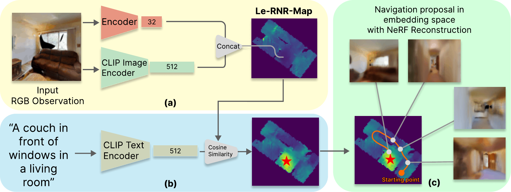

<h1 align="center">
Language-enhanced RNR-Map: Querying Renderable Neural Radiance Field Maps with Natural Language.
</h1>



<h3 align="center"><a href="https://arxiv.org/abs/2308.08854">Paper</a> | <a href="https://www.youtube.com/watch?v=UmIW3k0ZyDE">Video</a> | <a href="https://intelligolabs.github.io/Le-RNR-Map/">Project Page</a></h3>

# Table of Contents
- [Citation](#cite-le-rnr-map)
- [Version](#version)
- [Habitat simulator](#habitat-simulator)
- [Dataset](#dataset)
- [Project structure](#project-structure)
- [Launch map creation](#launch-map-creation)
- [Query map](#query-map)
- [Ack](#ack)

## Cite Le-RNR-Map
If you find our work useful, please consider citing:
```BibTeX
@InProceedings{Taioli_2023_ICCV,
    author    = {Taioli, Francesco and Cunico, Federico and Girella, Federico and Bologna, Riccardo and Farinelli, Alessandro and Cristani, Marco},
    title     = {{Language-Enhanced RNR-Map: Querying Renderable Neural Radiance Field Maps with Natural Language}},
    booktitle = {Proceedings of the IEEE/CVF International Conference on Computer Vision (ICCV) Workshops},
    month     = {October},
    year      = {2023},
    pages     = {4669-4674}
}
```

# Version 
- Python version: 3.8
- Habitat-lab: 0.2.1
- Habitat-sim: 0.2.1
- Torch:  ```pip install torch==1.13.0+cu117 torchvision==0.14.0+cu117 torchaudio==0.13.0 --extra-index-url https://download.pytorch.org/whl/cu117```
- Clip: ```pip install git+https://github.com/openai/CLIP.git```

# Habitat simulator
For the habitat setup visit the page https://github.com/facebookresearch/habitat-lab/tree/v0.2.1#Gibson
# Dataset
- For the Gibson scene dataset, containing the .glb 3D models, refer to  https://github.com/facebookresearch/habitat-lab/tree/v0.2.1#data
- For the task dataset, containing the navigation episodes, refer to https://github.com/devendrachaplot/Object-Goal-Navigation
# Project structure
```
├── data
│   └── gibson
│       └── scene_dataset
│           └── gibson_habitat
├── pretrained
├── src
│   └── model
│       └── autoencoder
│           └── GSN
├── heat_maps
│   ├── multi_search
│   └── single_search
├── images
│   ├── map_generation
│   └── query_map
├── lernr_maps
├── lernr
├── requirements.txt
├── evaluation.py
├── map_creation.py
├── query_map.py
└── README.md
```
- ```data```: It contains the dataset,
- ```pretrained```: It contains the pretreined autoencoder models,
- ```src```: It contains the encoding and decoding processes,
- ```heatmaps```: It contains the output heatmaps for the single/multi search,
- ```lernr_map```: It contains the lernr maps as dictionary,
- ```images```: It contains the video generated by the navigation/querying,
- ```lernr```: It contains utils files,
- ```evaluation.py```: It performs an evaluation on the maps contained in the <em>lernr_maps</em> folder,
- ```map_creation.py```: It generates lernr maps,
- ```query_map.py```: It queries the maps on single or multi search.
# Launch map creation
- Example:

    ```python map_creation.py --scene="Wiconisco" --n_goals=25 --img_res=128 --map_size=128```

 - scene: Name of the scene (default: Cantwell)
 - n_goals: Number of goal points to reach (default: 25) 
 - img_res: Input img resolution entering the encoder (default: 128)
 - map_size: Lernr_map's resolution (default: 128) 
 - make_video: If present, a video of the navigation is generated (default: false)

 # Query map

 - Outputs:
    - Single object search:
        - For each different word queries a heat map is saved. 
    - Multi object search:
        - A heat map with different locations of the given query word is saved.

- Example
    - Single object search: 
        - ```python query_map.py --scene="Wiconisco" --query_words="toilet, couch" --negative_prompt="objects, textures" --make_video --smooth```
    - Multi object search:
        - ```python query_map.py --scene="Cantwell" --query_words="Window" --make_video --smooth --erased_area=500  --th=0.6 --multi_search```
 
- scene: Name of the map (default: "Cantwell")
- query_words: Objects to search (default: "Window")
- negative_prompt: List of negative prompt (default: "stuff, things, objects, textures")
 - make_video: If present a video of the navigation is generated (default: False)
 - smooth: If present, the video generated is smooth (default: False)
 - multi_object: if present, a multi object search is performed, otherwise a sigle object search is made
 - erased_area: Area to delete, in order to perform multi object search (default: 500)
 - th: Treshold used in the multi object search to stop the navigation (default: 0.6)


# Ack
```bibtex
@InProceedings{Kwon_2023_CVPR,
    author    = {Kwon, Obin and Park, Jeongho and Oh, Songhwai},
    title     = {Renderable Neural Radiance Map for Visual Navigation},
    booktitle = {Proceedings of the IEEE/CVF Conference on Computer Vision and Pattern Recognition (CVPR)},
    month     = {June},
    year      = {2023},
    pages     = {9099-9108}
}
```


